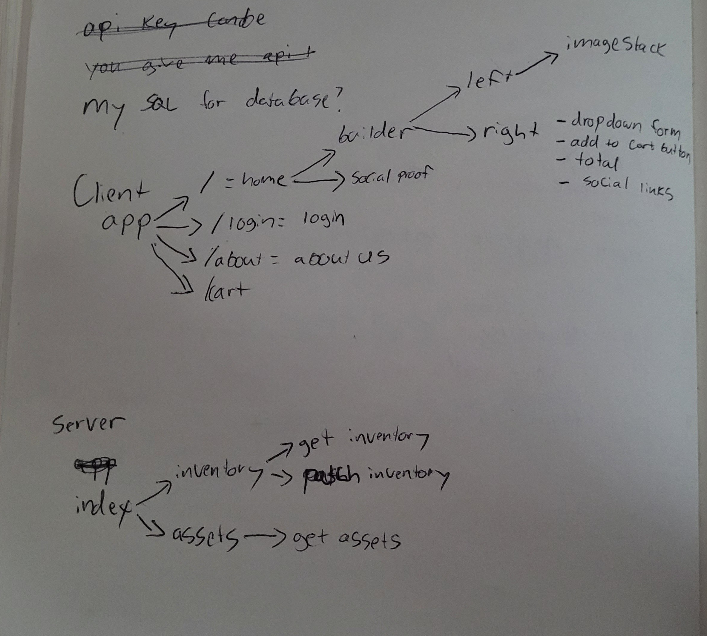
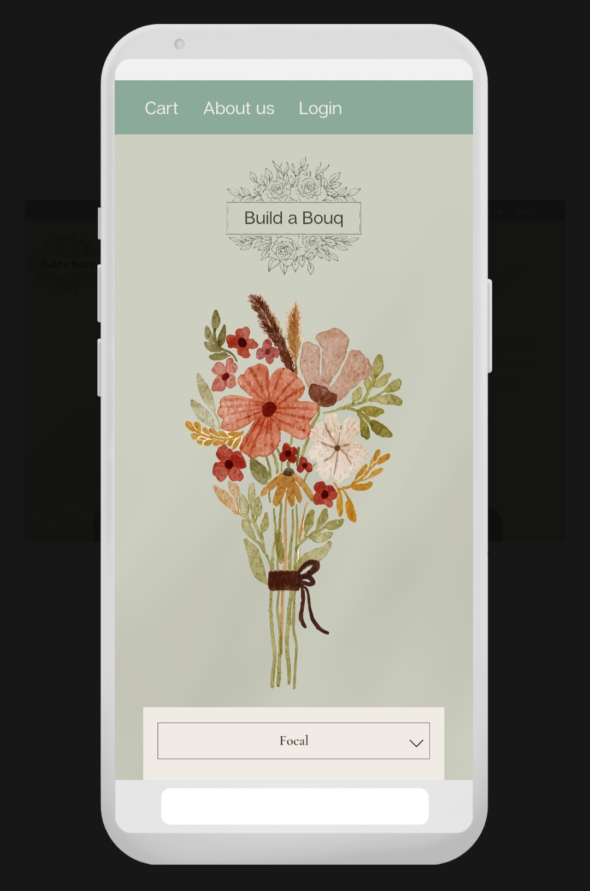
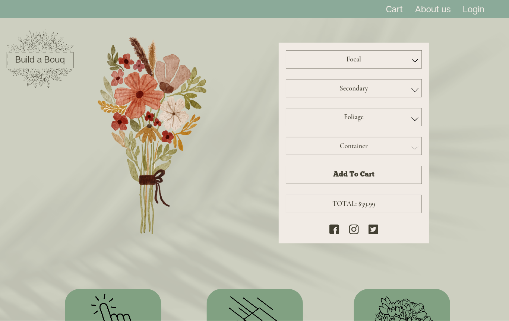

# Build a Bouq 💐

## Overview

Build a Bouq is an interactive tool for flower shop owners to use on their website, to help increase engagement and drive sales. Users are able to pick flowers from the stores inventory, and have them displayed visually on screen in the way that they would expect to see them in real person. Users can then add that custom boquet to their shopping cart and checkout.

### Problem

Most flower shop websites are old and outdated, with no real way to see what it is that your ordering. There are usually short descriptions, referencing the colour themes, size and/or a list of flowers that are usually included, but flowers are seasonal and things change. Most flower shop websites will have a photo of a bouquet, but if you've ever ordered flowers for someone, you know that you usually have to wait to recieve a picture from the recipient in order to really know what you bought.

Websites should be interactive to hold attention, and users should be able to make orders effortlessly.  
Store owners should be able to showcase ALL their inventory and having a way to do that is essential.

The more that a customer looks forward to buying your product, the easier it is to sell. The simpler it is to purchase, the more likely it is that it will happen.

People love building things, so this app will showcase the options available and make it efortless to checkout.

### User Profile

Sprint 2:
Owners - an admin account, to retrieve inventory, aquire API key, update inventory
Customers - a user account that displays order history and holds customer info

### Features

Preview component:
---> This will dynamically display the users selected inputs

Options component:
---> There will be multiple layers for the user to choose - focal, secondary and folliage for example.
------> Within those layers, options will be available - lilly's, sunflowers, ferns for example.
---------> Focal and secondary will have the same options avilable

Price will be displayed:
---> Each individual flower will show its cost
------> There will be a grand total (+shipping and taxes)
---------> Add to cart will be the CTA

## Implementation

### Tech Stack

List technologies that will be used in your app, including any libraries to save time or provide more functionality. Be sure to research any potential limitations.
HTML
SCSS
REACT
AXIOS
NODE
EXPRESS
MySQL

### APIs

I will need to create my own API that the client can request to. In order for the app to work,
the client will need to install the app and obtain an API key. The API key will fetch the flower
images from the server to be displayed live on the website, based off what inventory the store has.

### Sitemap

#### Homepage

---> This will be where main feature of this application will live.
------> It will have a nav bar ontop, the builder component as the hero and then some hooks and social proof below to help secure sales

### Login

To be implimented in sprint 2:
---> This is where owners can log in so that they can use the app and retrieve the images.
---> This is where users can log in so that they can see their purchase history.

### About

---> This will be a brief description of the "company" and/or will outline the project, and why it was built

### Mockups

### Data

Describe your data and the relationships between them. You can show this visually using diagrams, or write it out.
For the purpose of this project, a mock inventory data file will be created and hosted on the server. This will be retrieved from and updated by actions taken on the client. The large picture is to retrieve the inventory from a store, from whereever they store it, but for now this app will use mock data.

The assets of the flower images will be stored on an outside CDN server, so that the images can be quickly retrieved via a link, rather than stored on the app's server.

### Endpoints

Get localhost:8080/inventory
Put localhost:8080/inventory

Sprint 2:
Get localhost:8080/login (user ID data)

### Auth

Store owners will need to use an API key in order to retrieve the flower images.

## Roadmap

Sprint 1:
As described in this document, a user will be able to build their custom bouqet based on the stores inventory. They will be able to see the total price and add to cart. A basic functioning web design will be implimented and become more complex in future sprints.

Sprint 2:
Impliment a login feature for both store owners (admin) and customers (users).
Impliment an authorization factor, such as a JSON Token.
Add more flowers to pick from.
Users can login and see their order history.

Sprint 3:
Optimize for an app store such as Shopify.
Transform this app into a format that will be accepted as a plug and play for currently designed websites.

## Nice-to-haves

-   Login feature
-   Json token auth
-   Better flower images
-   More flower images
-   A functioning cart

### Current considerations

How to deal with store inventory
---> Do they need to host inventory data on my server?
------> can they send inventory data instead so its only get request?

API Key
---> How do I make one?

Users
---> Can this be the responsability of soowner? (as Build a Bouq is only for stores, users are stores responsability)
